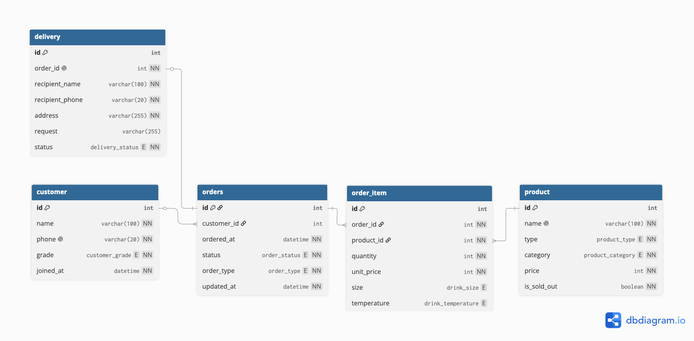

## 주제: 카페 주문 DB

SQL만으로 카페 주문 도메인의 데이터 모델을 설계하고, 요구사항을 쿼리로 해결하는 실습이다.
백엔드 프레임워크와 ORM은 사용하지 않는다.

---

## 개발 환경

| 항목             | 값                                  |
| -------------- | ---------------------------------- |
| DBMS           | MySQL 8.0                          |
| Storage Engine | InnoDB                             |
| Character Set  | utf8mb4 (`utf8mb4_unicode_ci`)     |
| 실행 환경          | Docker (OrbStack)                  |
| 클라이언트          | VSCode MySQL Extension / mysql CLI |

InnoDB를 명시한 이유는 MyISAM에서는 FK 문법이 무시되어 참조 무결성이 동작하지 않기 때문이다.

`CHECK` 제약은 MySQL 8.0.16부터 실제로 검사되며, 그 이전 버전에서는 구문이 허용되더라도 제약이 적용되지 않는다.

---

## 실행 방법

### 1. DB 컨테이너 실행

```bash
docker run -d \
  --name cafe-mysql \
  -e MYSQL_ROOT_PASSWORD=root \
  -p 3306:3306 \
  -v cafe-mysql-data:/var/lib/mysql \
  mysql:8.0
```

### 2. 스키마 생성

```bash
docker exec -i cafe-mysql mysql -uroot -proot < schema.sql
```

`schema.sql`은 기존 테이블을 먼저 삭제하므로 여러 번 실행해도 동일한 스키마를 구성할 수 있다.

---

## ERD



* 정의 파일: [`docs/schema.dbml`](./docs/schema.dbml)
* 다이어그램 도구: dbdiagram.io

### 관계

| 관계                     |  카디널리티 | ON DELETE | 근거                                                 |
| ---------------------- | -----: | --------- | -------------------------------------------------- |
| `customer → orders`    |    1:N | SET NULL  | 회원이 탈퇴해도 주문 기록과 매출은 남아야 함                          |
| `orders → order_item`  |    1:N | CASCADE   | 주문이 삭제되면 항목도 존재 이유가 없음                             |
| `product → order_item` |    1:N | RESTRICT  | 판매된 상품을 지우면 과거 주문을 설명할 수 없음                        |
| `orders → delivery`    | 1:0..1 | CASCADE   | 주문 1건당 배달 정보는 최대 1건이며, 배달 주문이 아닌 경우 배달 정보가 존재하지 않음 |

`ON UPDATE`는 지정하지 않았다. 이 설계에서는 AUTO_INCREMENT PK를 식별자로 사용하고 애플리케이션에서 PK를 변경하지 않도록 하므로 `ON UPDATE CASCADE`가 필요한 상황이 없다. 불필요한 옵션을 추가하기보다 현재 도메인에서 필요한 삭제 정책만 명시했다.

---

## 테이블

| 테이블          | 역할                                              |
| ------------ | ----------------------------------------------- |
| `customer`   | 회원. 비회원은 저장하지 않고 `orders.customer_id`를 NULL로 둔다 |
| `product`    | 음료/디저트 공통 상품 정보                                 |
| `orders`     | 주문 헤더. 주문 전체에 공통인 정보만 저장한다                      |
| `order_item` | 주문 항목. 항목마다 달라지는 정보를 저장한다                       |
| `delivery`   | 배달 주문의 배송 정보를 저장한다                              |

---

## 설계 결정

### 계산으로 나오는 값은 저장하지 않는다

`orders`에 총액 컬럼을 두지 않고 `SUM(quantity * unit_price)`로 계산한다.

총액을 저장하면 `order_item`이 수정될 때 함께 갱신해야 하고, 갱신이 누락되어도 데이터가 어긋날 수 있다.

같은 이유로 `customer`에 누적 주문 횟수를, `product`에 총 판매량을 저장하지 않았다.

배달비나 할인처럼 `order_item`만으로 계산할 수 없는 금액이 추가된다면 별도로 저장할 근거가 생긴다.

### `unit_price`는 의도적으로 중복 저장한다

`product.price`는 **현재 판매 가격**, `order_item.unit_price`는 **주문 당시 실제 판매 가격**을 의미한다.

주문 항목의 금액을 현재 `product.price`와 JOIN하여 계산하면 가격표가 변경되는 순간 과거 주문의 금액까지 변경된다.

따라서 주문 시점의 가격을 `order_item`에 저장하여 과거 주문 금액을 보존한다. 이는 동일한 사실을 중복 저장하는 것이 아니라 서로 다른 시점의 가격을 저장하는 것이다.

### 비회원은 행을 만들지 않는다

`customer`는 회원만 저장한다.

따라서 회원의 `joined_at`은 항상 존재하며 `NOT NULL`로 둘 수 있다.

비회원 주문은 `orders.customer_id`를 `NULL`로 저장한다.

FK는 NULL을 허용해도 참조 무결성이 깨지지 않는다. 값이 있으면 반드시 존재하는 회원을 참조해야 하고, NULL이면 회원을 참조하지 않는 주문으로 취급한다.

### 주문 상태와 배송 상태를 분리한다

`orders.status`는 주문 처리 상태를 담당한다.

```text
PENDING → PREPARING → COMPLETED
                     ↘ CANCELLED
```

`delivery.status`는 배송 진행 상태만 담당한다.

```text
WAITING → DELIVERING → DELIVERED
```

두 상태를 하나로 합치지 않고 분리함으로써 주문 처리와 배송 진행이라는 서로 다른 상태를 독립적으로 표현할 수 있다.

취소된 주문을 DELETE하지 않고 상태로 관리하는 이유는 주문 기록을 보존하여 취소율 등의 통계에 활용할 수 있도록 하기 위해서다.

### 음료와 디저트를 한 테이블에 둔다

초안에서는 `product` / `drink` / `dessert` / `drink_size` / `drink_temperature`로 분리하는 방식을 고려했다.

하지만 과제에서 정규화 이론을 과도하게 깊게 다루지 않고 자연스러운 관계와 쿼리에 집중하도록 요구하고 있으므로, 음료와 디저트의 공통 상품 정보를 `product` 하나로 관리한다.

대신 `type`과 `category`의 유효한 조합은 `CHECK` 제약으로 DB에서 강제한다.

```text
DRINK
 ├─ COFFEE
 └─ NON_COFFEE

DESSERT
 ├─ WHOLE_CAKE
 ├─ SLICE_CAKE
 ├─ BAKED_GOODS
 └─ BREAD
```

---

## DB 제약으로 강제하지 않는 비즈니스 규칙

DB의 제약 조건으로 데이터 구조와 기본적인 참조 무결성을 보장하되, 모든 비즈니스 규칙을 DB에 구현하지는 않았다.

### DB에서 강제하는 것

| 제약       | 대상                                                                                        |
| -------- | ----------------------------------------------------------------------------------------- |
| PK       | 모든 테이블                                                                                    |
| FK       | `orders.customer_id`, `order_item.order_id`, `order_item.product_id`, `delivery.order_id` |
| UNIQUE   | `customer.phone`, `product.name`, `delivery.order_id`                                     |
| NOT NULL | 각 테이블의 필수 컬럼                                                                              |
| CHECK    | `product`의 type/category 조합, `price >= 0`, `quantity > 0`, `unit_price >= 0`              |
| ENUM     | 상태, 분류, 사이즈, 온도 등의 허용 값                                                                   |

### DB에서 강제하지 않는 규칙

#### 상품별 제공 사이즈/온도

`order_item.size`와 `order_item.temperature` 자체의 값 종류는 ENUM으로 DB에서 제한한다.

하지만 **특정 상품이 어떤 사이즈와 온도를 제공하는지**는 상품마다 다를 수 있다.

예를 들어 어떤 음료는 `REGULAR/LARGE/MAX`와 `ICE/HOT`을 모두 지원하고, 다른 음료는 `REGULAR/HOT`만 지원할 수 있다.

이 규칙까지 DB에서 강제하려면 별도의 옵션 테이블과 관계를 추가해야 한다. 현재 과제에서는 스키마 복잡도를 늘리는 대신 해당 규칙을 비즈니스 로직에서 검증하는 것으로 두었다.

#### `DELIVERY` 주문에만 `delivery` 생성

`delivery.order_id`가 참조하는 주문의 `order_type`이 `DELIVERY`인지 여부는 단순한 `CHECK` 제약만으로는 검사할 수 없다.

복합 PK `(id, order_type)`와 복합 FK를 사용하면 DB에서 이 규칙까지 강제할 수 있다.

하지만 `order_type`은 주문 자체를 식별하기 위한 값이 아니라 주문의 속성이므로 이를 PK와 FK 구조에 포함시키면 참조 구조와 쿼리가 복잡해진다.

따라서 현재 설계에서는 주문의 식별자를 단순한 `id`로 유지하고, `DELIVERY` 여부는 비즈니스 로직에서 검증하는 것으로 결정했다.

즉, **DB로 강제할 수 없어서 제외한 것이 아니라, 강제할 수 있는 방법과 그에 따른 복잡도를 고려하여 현재 범위에서는 적용하지 않은 것이다.**

#### 전화번호 형식

`phone`의 형식은 입력 방식에 따라 유효한 표현이 여러 가지일 수 있다.

따라서 현재 스키마에서는 문자열의 길이와 NULL 여부 정도만 관리하고, 구체적인 형식 검증은 입력을 처리하는 계층에서 담당하는 것으로 둔다.

#### 디저트 항목의 `size` / `temperature`

`size`와 `temperature`는 음료에만 의미가 있는 속성이다.

현재 구조에서는 디저트 주문에 해당 컬럼이 `NULL`이어야 한다는 규칙을 별도로 강제하지 않는다.

이 규칙을 DB에서 엄격하게 강제하려면 상품 종류와 주문 항목을 함께 검사해야 하므로 추가적인 관계 설계가 필요하다. 현재 과제에서는 이를 비즈니스 규칙으로 분류한다.

---

## MySQL 전용 문법

표준 SQL 범위를 벗어난 문법은 SQL 파일에 주석으로 표시했다.

| 문법                               | 사용처                   |
| -------------------------------- | --------------------- |
| `AUTO_INCREMENT`                 | 모든 테이블의 PK            |
| `ENUM(...)`                      | 상태/분류/옵션 컬럼           |
| `BOOLEAN`                        | `product.is_sold_out` |
| `ON UPDATE CURRENT_TIMESTAMP`    | `orders.updated_at`   |
| `ENGINE` / `CHARSET` / `COMMENT` | 모든 테이블                |

`BOOLEAN`은 MySQL에서 `TINYINT(1)`의 별칭으로 동작한다.

`ENUM`은 허용되는 값의 종류가 명확하고 변경 빈도가 낮은 상태/분류/옵션 값에 사용했다. 값이 추가되면 `ALTER TABLE`이 필요하므로 변경이 잦은 데이터에는 적합하지 않다.

ENUM의 선언 순서는 상태 진행 순서에 맞췄다. MySQL에서 ENUM은 선언 순서가 곧 정렬 순서가 되므로, `ORDER BY status`의 결과가 알파벳순이 아니라 실제 상태 흐름과 일치하게 된다.

---

## 제출물

```text
.
├── README.md
├── docs/
│   ├── schema.dbml
│   └── erd.png
└── sql/
    └── schema.sql	# 스키마 생성
```

현재 단계에서는 **스키마 설계와 ERD 작성까지 완료**한 상태다.

추후 데이터 및 쿼리 작성이 완료되면 다음 파일을 추가한다.

```text
├── data.sql        # 샘플 데이터
└── queries.sql     # 핵심 쿼리

results/            # 쿼리 실행 결과
```