# AWS VPC 기반 웹 서비스 인프라 구축

VPC로 격리된 네트워크를 CloudFormation으로 구성하고, 퍼블릭 서브넷의 EC2에 웹 서비스를 배포해 외부에서 접속 가능한 환경을 만든 과제입니다. 보안 그룹과 IAM 최소권한을 적용했고, 보너스로 Docker 컨테이너 배포와 HTTPS(Let's Encrypt)까지 적용했습니다.

| 항목 | 내용 |
|---|---|
| 리전 | `ap-northeast-2` (서울) |
| 배포 방식 | CloudFormation (`infra/web-infra.yml`), AWS CLI |
| 스택 이름 | `codyssey-b3-1` |
| 인스턴스 | EC2 `t3.micro`, Ubuntu 24.04 LTS, EBS gp3 8GiB |
| 실습 IAM 사용자 | `codyssey` (정책 `iam-policy.json`, 관리자 권한 없음) |
| 외부 접속 검증 | **방식 B** · `GET http://3.35.176.96/health` → `200 OK` |
| 보너스 | Docker 컨테이너 배포, HTTPS (`https://cody-aws.duckdns.org`) |

> 실습 종료 후 모든 리소스를 삭제했기 때문에 위 IP와 도메인은 현재 접속되지 않습니다. 검증 결과는 스크린샷으로 대신합니다.

---

## 1. 아키텍처

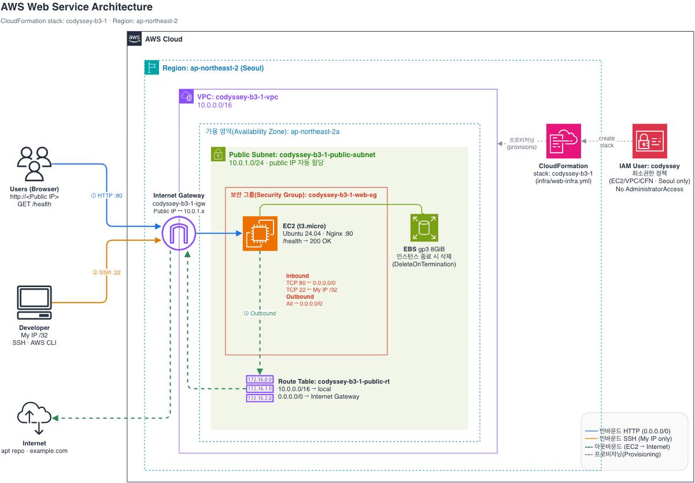

### 구성 요소와 역할

| 구성 요소 | 이름 / 값 | 역할 |
|---|---|---|
| VPC | `codyssey-b3-1-vpc` · `10.0.0.0/16` | 다른 네트워크와 격리된 사설 네트워크. 리전 전체에 걸침 |
| Public Subnet | `codyssey-b3-1-public-subnet` · `10.0.1.0/24` | VPC 대역을 쪼갠 구역. AZ 하나(`ap-northeast-2a`)에 속하며, 인스턴스에 퍼블릭 IP 자동 할당 |
| Internet Gateway | `codyssey-b3-1-igw` | VPC와 인터넷 사이의 출입구. 퍼블릭 IP ↔ 사설 IP(10.0.1.x) 변환 |
| Route Table | `codyssey-b3-1-public-rt` | `10.0.0.0/16 → local`, `0.0.0.0/0 → IGW`. 서브넷에 명시적으로 연결 |
| Security Group | `codyssey-b3-1-web-sg` | 인스턴스 단위 방화벽. 인바운드 80·443 전체, 22 내 IP만 |
| EC2 | `t3.micro` · Ubuntu 24.04 | 웹 서버(Nginx), 보너스 단계에서 Docker 컨테이너 실행 |
| EBS | gp3 8GiB | 루트 볼륨. `DeleteOnTermination: true`로 인스턴스 종료 시 함께 삭제 |

### 트래픽 흐름

**외부 → 서비스 (인바운드)**

```
브라우저 → 인터넷 → IGW(퍼블릭 IP → 10.0.1.x) → 보안 그룹(80 허용) → EC2 Nginx
```

외부 요청이 EC2 웹 서버까지 도달하려면 세 가지가 모두 필요합니다.

1. **라우팅**: 서브넷에 연결된 라우트 테이블에 `0.0.0.0/0 → IGW` 경로가 있어야 응답이 인터넷으로 돌아갈 수 있습니다. 서브넷이 "퍼블릭"인지는 이름이 아니라 이 경로로 결정됩니다.
2. **퍼블릭 IP**: 인스턴스에 퍼블릭 IP가 있어야 인터넷에서 주소로 찾아올 수 있습니다. 인스턴스 안에서는 사설 IP(`10.0.1.16`)만 보이고, 변환은 IGW가 담당합니다.
3. **보안 그룹**: 해당 포트(80)의 인바운드가 허용돼야 합니다. 보안 그룹은 상태 저장(stateful)이라 허용된 요청의 응답은 별도 규칙 없이 나갑니다.

**EC2 → 인터넷 (아웃바운드)**

```
EC2 → 보안 그룹(아웃바운드 전체 허용) → 라우트 테이블(0.0.0.0/0 → IGW) → IGW → 인터넷
```

첫 부팅 시 `apt`로 Nginx를 설치하고, `curl https://example.com`이 성공하는 것이 이 경로 덕분입니다.

---

## 2. 레포 구조

```
.
├── infra/
│   ├── web-infra.yml       # CloudFormation 템플릿 (VPC ~ EC2 전체)
│   └── iam-policy.json     # 실습 IAM 사용자 최소권한 정책 (콘솔에서 수동 적용함)
├── docker/
│   ├── Dockerfile          # nginx:stable-alpine-slim 기반 웹 이미지
│   ├── default.conf        # 컨테이너 Nginx 설정 (/health 포함)
│   └── index.html
├── nginx/
│   └── host-proxy.conf     # EC2 호스트 Nginx 설정 (리버스 프록시 + HTTPS)
├── docs/
│   ├── architecture.png
│   ├── troubleshooting.md
│   ├── cleanup-checklist.md
│   └── images/             # 검증 스크린샷
└── README.md
```

`infra/web-infra.yml`의 UserData는 **초기 구성**(Nginx 설치, `/health`)만 담당합니다. 이후 프록시·HTTPS 설정은 `nginx/host-proxy.conf`로 관리했습니다.

---

## 3. 배포 방법

### 사전 준비

1. 루트 계정으로 IAM 사용자 `codyssey`를 만들고 `infra/iam-policy.json` 정책을 연결합니다. 이후 루트 계정은 사용하지 않습니다.
2. `codyssey`의 액세스 키로 CLI 프로필을 등록합니다.

```bash
aws configure --profile codyssey      # region: ap-northeast-2
export AWS_PROFILE=codyssey
aws sts get-caller-identity           # Arn이 ...:user/codyssey 인지 확인
```

3. SSH 키페어를 생성합니다. 개인키는 레포 밖(`~/.ssh`)에 생성합니다..

```bash
aws ec2 create-key-pair --key-name cloud-mission --key-type ed25519 \
  --query KeyMaterial --output text > ~/.ssh/cloud-mission.pem
chmod 400 ~/.ssh/cloud-mission.pem
```

### 스택 배포

```bash
STACK=codyssey-b3-1

aws cloudformation validate-template --template-body file://infra/web-infra.yml

aws cloudformation create-stack \
  --stack-name $STACK \
  --template-body file://infra/web-infra.yml \
  --parameters ParameterKey=KeyName,ParameterValue=cloud-mission \
               ParameterKey=MyIp,ParameterValue=$(curl -s https://checkip.amazonaws.com)/32

aws cloudformation wait stack-create-complete --stack-name $STACK
aws cloudformation describe-stacks --stack-name $STACK \
  --query "Stacks[0].Outputs" --output table
```
- template-body 내용 확인: [web-infra.yml](infra/web-infra.yml)

| 파라미터 | 설명 |
|---|---|
| `KeyName` | 기존 키페어 이름 (존재 여부를 배포 전에 검사) |
| `MyIp` | SSH를 허용할 내 IP (`x.x.x.x/32` 형식만 허용) |
| `InstanceType` | `t2.micro` / `t3.micro`만 허용 (기본 `t3.micro`) |
| `LatestAmiId` | Canonical SSM 퍼블릭 파라미터로 최신 Ubuntu 24.04 AMI 자동 조회 |

| 스택 생성 | 스택 Outputs |
|---|---|
| 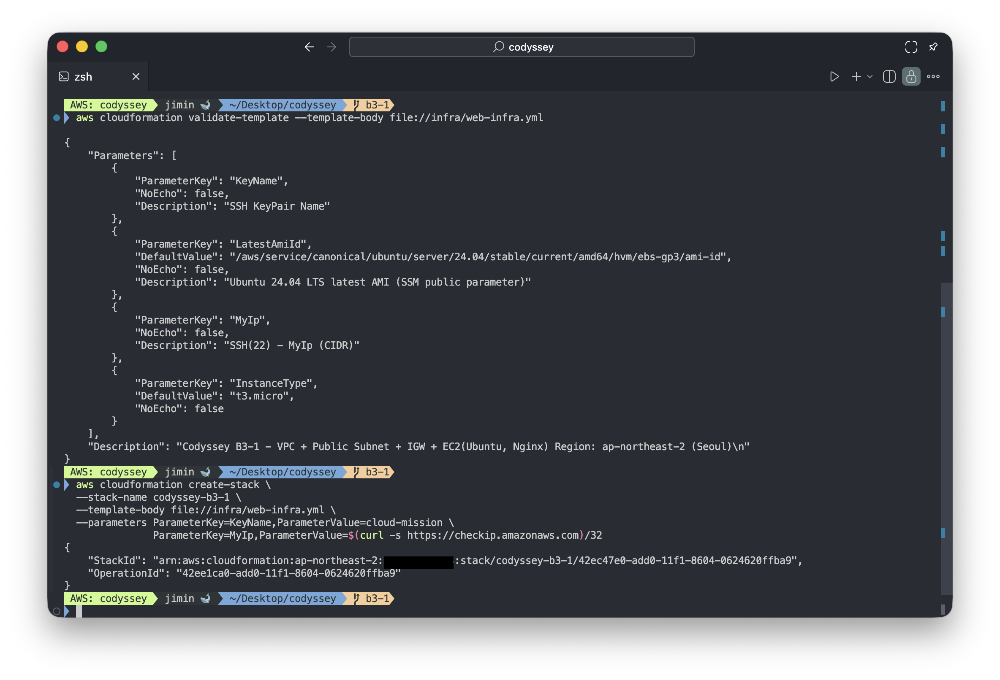 | 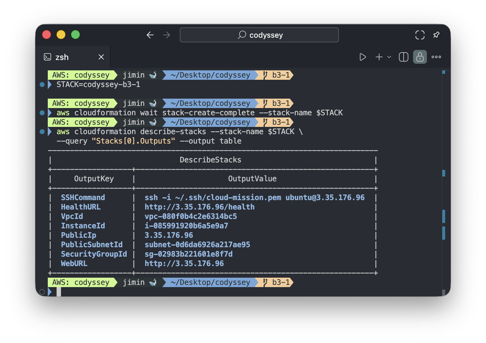 |

배포 후 보너스 단계(Docker, HTTPS)는 [5장](#5-보너스-2--docker-컨테이너-배포), [6장](#6-보너스-1--https-적용)을 참고하세요.

---

## 4. 요구사항별 검증

| 요구사항 | 결과 | 근거 |
|---|---|---|
| VPC 1개, Public Subnet 1개 | ✅ | `stack-outputs.png`, `route-table.png` |
| IGW를 VPC에 연결 | ✅ | `route-table.png` (대상 `igw-...` 활성) |
| Route Table에 `0.0.0.0/0 → IGW` | ✅ | `route-table.png` |
| 서브넷에 라우트 테이블 명시적 연결 | ✅ | `route-table-association.png` |
| 인스턴스 아웃바운드 통신 | ✅ | `ssh-internal-check.png` (`example.com` 200) |
| EC2 1대, SSH 접속 | ✅ | `ssh-internal-check.png` |
| 웹 서버 실행, `curl localhost` 200 | ✅ | `ssh-internal-check.png` |
| HTTP(80) 전체 허용 | ✅ | `security-group.png` |
| SSH(22) 내 IP만 허용 | ✅ | `security-group.png` (`/32`) |
| 전체 포트 허용 규칙 없음 | ✅ | `security-group.png` |
| IAM 최소권한, 관리자 권한 없음 | ✅ | `iam-policy.png`, `cli-user-policy.png` |
| 루트 계정 미사용 | ✅ | `cli-profile.png` (`user/codyssey`) |
| 외부 접속 검증 (방식 B) | ✅ | `external-check.png` |
| 리소스 정리 | ✅ | [`docs/cleanup-checklist.md`](docs/cleanup-checklist.md) |

### 4.1 네트워크

라우트 테이블의 `0.0.0.0/0 → igw` 경로는 템플릿의 `DefaultRouteToIGW`가, `10.0.0.0/16 → local`은 라우트 테이블 생성 시 자동으로 추가된 것입니다. "기본: 아니요"는 VPC 기본 라우트 테이블이 아닌 별도 테이블이라는 뜻입니다.

| 라우팅 | 서브넷 연결 |
|---|---|
| 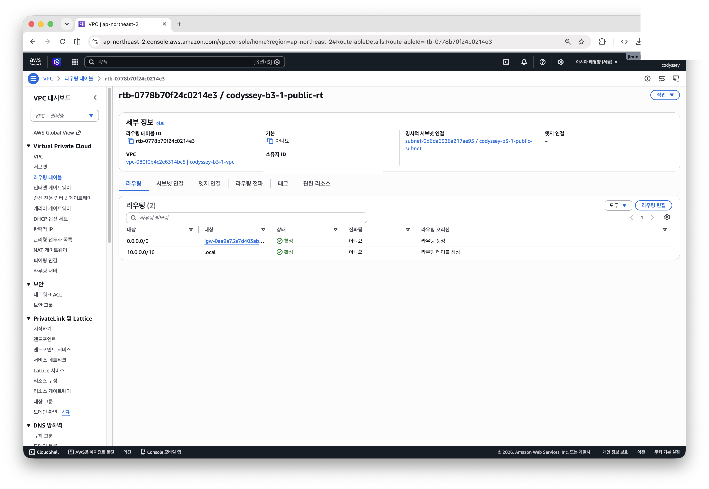 | 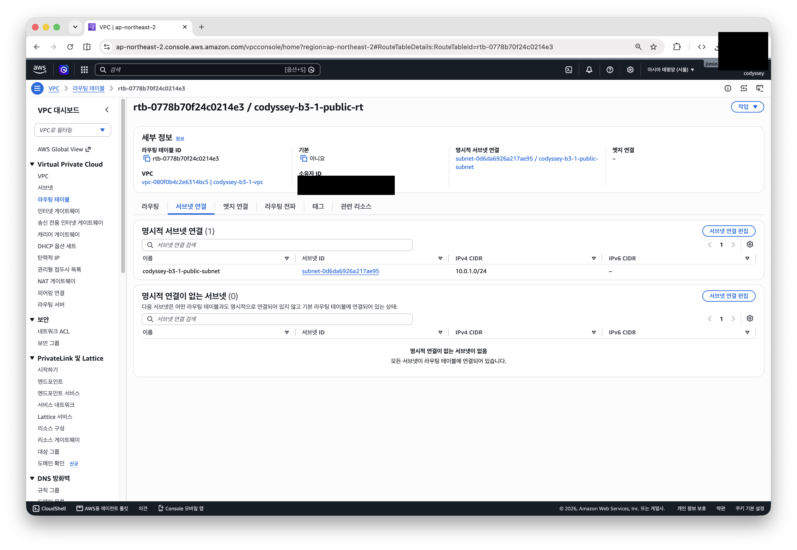 |

서브넷 연결 탭의 "명시적 연결이 없는 서브넷 (0)"은 기본 라우트 테이블(local 경로만 존재)로 빠진 서브넷이 없다는 뜻입니다. 이 연결이 없으면 퍼블릭 IP가 있어도 인터넷 통신이 되지 않습니다.

### 4.2 인스턴스 내부 검증

SSH로 접속해 웹 서버(`localhost` 200), 아웃바운드(`example.com` 200), Nginx 실행 상태(`active (running)`)를 확인했습니다. 프롬프트의 `ip-10-0-1-16`은 인스턴스가 서브넷 대역의 사설 IP로 동작함을 보여줍니다.

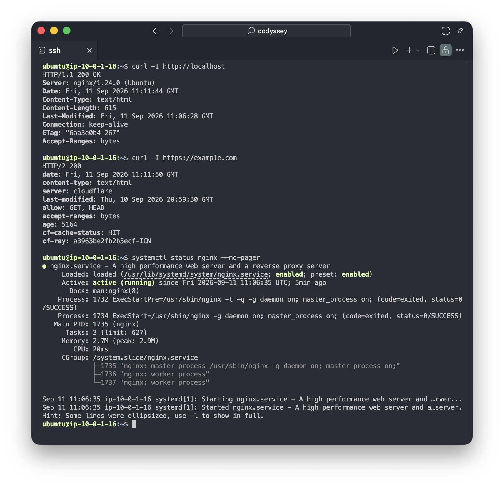

### 4.3 보안 그룹

인바운드는 필요한 포트만 허용하고, 전체 포트(0-65535) 허용 규칙은 없습니다. 인스턴스에 IAM 역할이 연결되지 않은 것(`IAM 역할: –`)도 확인할 수 있습니다.

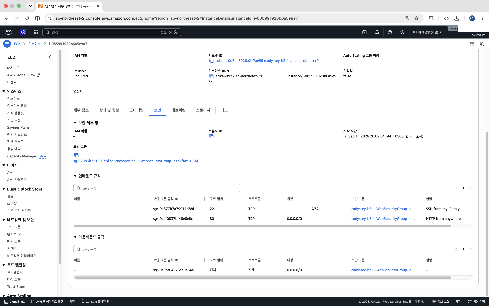

> 443 규칙은 보너스 1(HTTPS) 단계에서 추가했습니다. 추가 후 규칙은 [6장](#6-보너스-1--https-적용)에 있습니다.

### 4.4 외부 접속 검증 — 방식 B

- **선택 방식**: (B) `GET http://<퍼블릭IP>/health`
- **접속 정보**: `http://3.35.176.96/health`
- **결과**: `HTTP/1.1 200 OK`, 응답 본문 `OK`

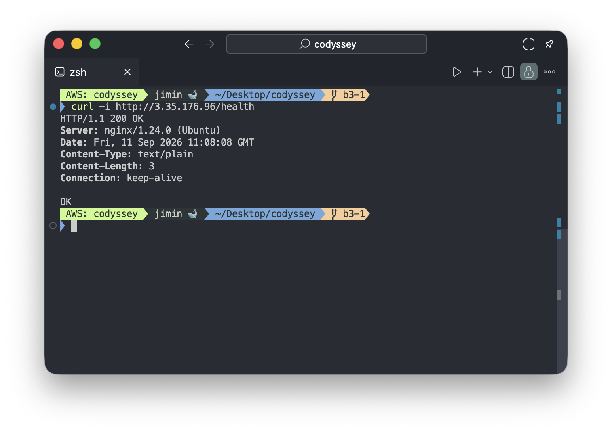

참고로 방식 A(브라우저로 `http://3.35.176.96` 접속)도 정상 표시됐습니다.

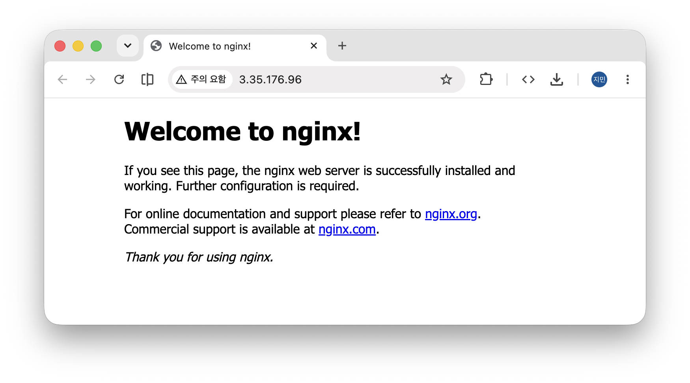

---

## 5. 보너스 2 · Docker 컨테이너 배포

### 구조

기존 호스트 Nginx는 요청을 받아 넘기는 리버스 프록시 역할만 하고, 실제 응답은 컨테이너가 합니다.

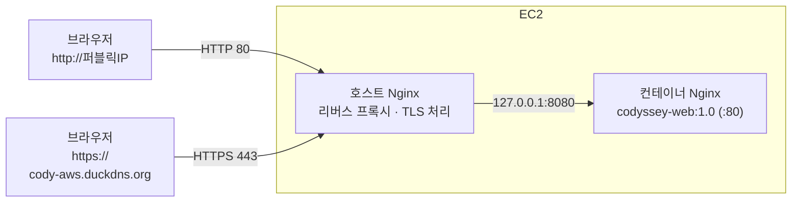
```mermaid
flowchart LR
    A["브라우저<br/>http://퍼블릭IP"] -->|HTTP 80| H
    B["브라우저<br/>https:// <br> cody-aws.duckdns.org"] -->|HTTPS 443| H
    subgraph EC2
        H["호스트 Nginx<br/>리버스 프록시 · TLS 처리"] -->|"127.0.0.1:8080"| C["컨테이너 Nginx<br/>codyssey-web:1.0 (:80)"]
    end
```

### 이미지와 실행 방식

- **이미지**: `codyssey-web:1.0` (베이스 `nginx:stable-alpine-slim`)
  - 추가 동적 모듈이 없는 slim 이미지를 선택했습니다. 설정이 Nginx 기본 기능만 사용하므로 필요한 것만 담았습니다.
- **구성 파일**: [`docker/`](docker/)
  - `default.conf`: `/health` 200 응답, 응답 출처 확인용 `X-Served-By: docker-container` 헤더
  - `index.html`: 호스트 Nginx 기본 페이지와 구분되는 커스텀 페이지

```bash
# 맥에서 EC2로 빌드 파일 복사
scp -i ~/.ssh/cloud-mission.pem -r docker ubuntu@<퍼블릭IP>:~/

# EC2에서
sudo apt-get install -y docker.io
sudo systemctl enable --now docker
cd ~/docker
sudo docker build -t codyssey-web:1.0 .
sudo docker run -d --name web --restart unless-stopped \
  -p 127.0.0.1:8080:80 codyssey-web:1.0
```

### 포트 매핑

| 구간 | 포트 | 설명 |
|---|---|---|
| 외부 → 호스트 Nginx | 80, 443 | 보안 그룹에서 허용 |
| 호스트 Nginx → 컨테이너 | `127.0.0.1:8080 → 80` | `-p 127.0.0.1:8080:80` |

컨테이너 포트를 `127.0.0.1`에만 바인딩해서 외부에서 8080으로 직접 들어올 수 없습니다. 보안 그룹에도 8080을 열지 않아 이중으로 차단됩니다. `--restart unless-stopped`로 인스턴스 재부팅 시 컨테이너가 자동으로 다시 시작됩니다.

호스트 Nginx 설정은 [`nginx/host-proxy.conf`](nginx/host-proxy.conf)이며, EC2의 `/etc/nginx/sites-available/default`에 적용했습니다.

### 검증

**컨테이너 실행 상태 (`docker ps`)**

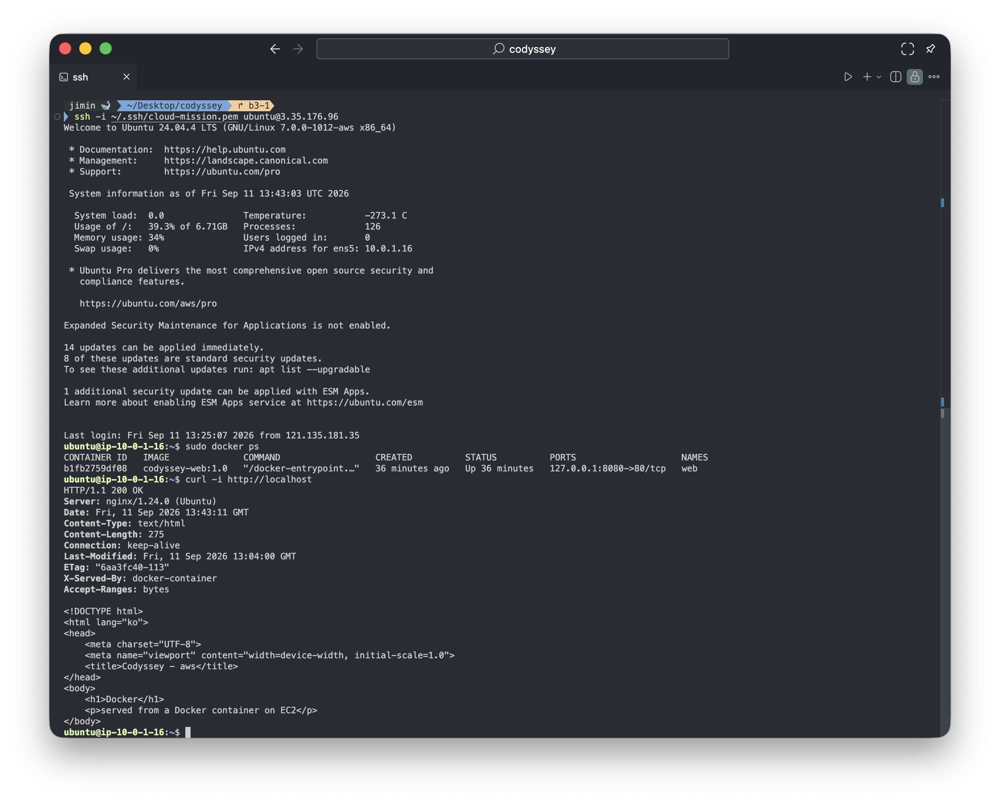

**외부 접속**: 도메인으로 접속하면 컨테이너의 커스텀 페이지가 표시됩니다.

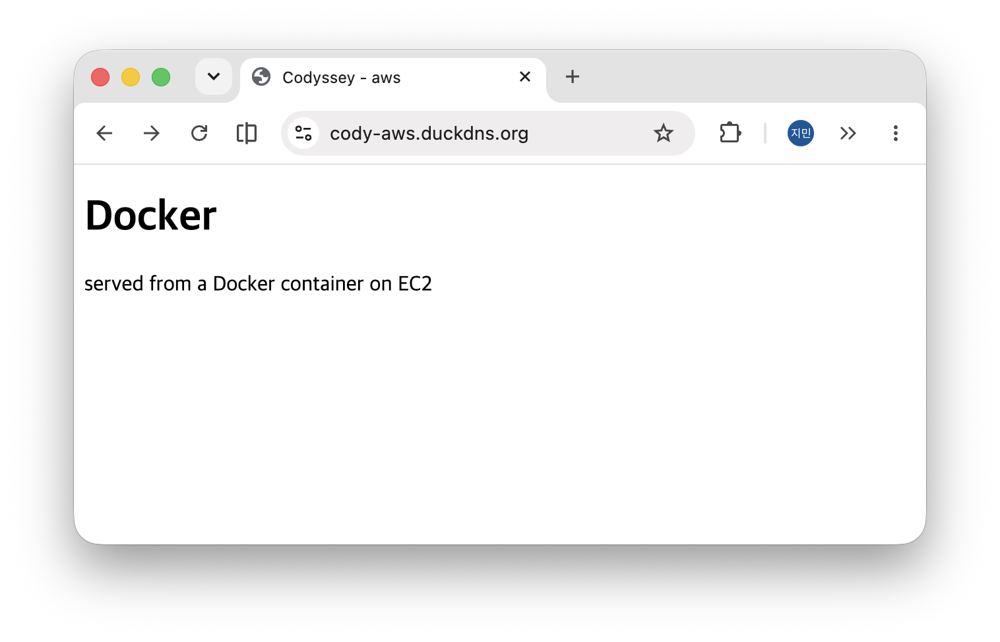

외부 `curl` 응답에는 호스트 Nginx의 `Server: nginx/1.24.0 (Ubuntu)`와 컨테이너가 붙인 `X-Served-By: docker-container`가 함께 찍혀, 요청이 호스트를 거쳐 컨테이너에서 처리됐음을 확인할 수 있습니다.

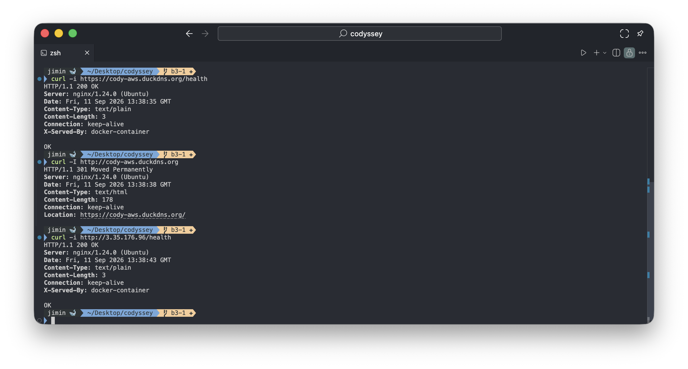

| 요청 | 결과 | 의미 |
|---|---|---|
| `https://cody-aws.duckdns.org/health` | `200 OK` + `X-Served-By` | HTTPS 정상, 컨테이너 응답 |
| `http://cody-aws.duckdns.org` | `301` → `https://...` | 도메인 HTTP는 HTTPS로 전환 |
| `http://3.35.176.96/health` | `200 OK` + `X-Served-By` | 필수 과제의 IP 검증(방식 B)은 보너스 적용 후에도 유지 |

---

## 6. 보너스 1 · HTTPS 적용

### 적용 과정

1. **보안 그룹에 443 추가**: 템플릿에 인바운드 규칙을 추가하고 스택을 업데이트했습니다. 업데이트 전 현재 인스턴스 AMI와 SSM 최신 AMI가 같은지 확인해 인스턴스 교체를 피했고, 이벤트 로그상 `WebSecurityGroup`만 수정되어 퍼블릭 IP가 유지됐습니다.
2. **도메인 연결**: DuckDNS에서 `cody-aws.duckdns.org`를 발급하고 퍼블릭 IP를 A 레코드로 연결했습니다.
3. **인증서 발급**: EC2에서 certbot으로 Let's Encrypt 인증서를 발급하고 호스트 Nginx에 적용했습니다.

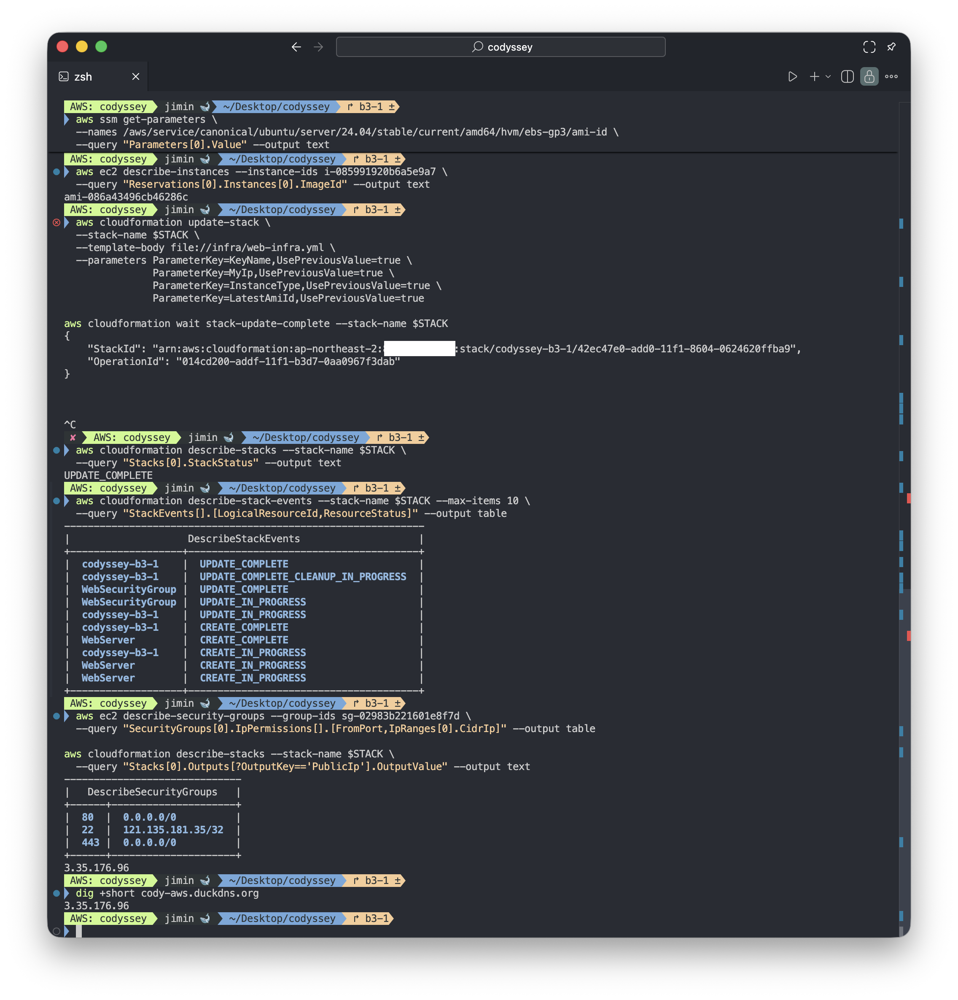

```bash
sudo apt-get install -y certbot python3-certbot-nginx
sudo certbot --nginx -d cody-aws.duckdns.org --redirect
sudo certbot renew --dry-run    # 90일 인증서 자동 갱신 확인
```

### Nginx 설정 구조

| server 블록 | 요청 | 동작 |
|---|---|---|
| `default_server` (80) | `http://<퍼블릭IP>` | 컨테이너로 프록시, HTTP 그대로 유지 |
| `cody-aws.duckdns.org` (443) | `https://도메인` | TLS 처리 후 컨테이너로 프록시 |
| `cody-aws.duckdns.org` (80) | `http://도메인` | `301` → HTTPS |

IP 요청과 도메인 요청을 별도 블록으로 나눠, **도메인만 HTTPS로 리다이렉트**하고 IP 기반 HTTP는 그대로 두었습니다. 전체를 리다이렉트하면 필수 과제의 `GET http://<IP>/health → 200`이 `301`로 바뀌기 때문입니다. `# managed by Certbot` 주석이 붙은 줄이 certbot이 추가한 부분이며, 변경 내역은 커밋 diff로 확인할 수 있습니다.

이 동작은 5장의 `https-redirect.png`에서 세 요청(HTTPS 200, 도메인 HTTP 301, IP HTTP 200)으로 한 번에 확인할 수 있습니다.

인증서는 도메인 이름에 발급된 것이라 `https://<퍼블릭IP>`로 접속하면 인증서 경고가 뜨는 것이 정상입니다.

---

## 7. 보안 설계

### 보안 그룹과 IAM의 차이

| | 보안 그룹 | IAM |
|---|---|---|
| 대상 | 네트워크 트래픽 | AWS API 호출 |
| 질문 | "누가 이 인스턴스의 **어느 포트**로 들어올 수 있나" | "누가 AWS에서 **어떤 작업**을 할 수 있나" |
| 이 과제에서 | 80·443 전체, 22 내 IP만 | `codyssey`는 EC2/VPC/CFN 작업만, 서울 리전만 |

### IAM 최소권한

정책 `b3-1` ([`infra/iam-policy.json`](infra/iam-policy.json))

- **필요한 작업만 허용**: AWS 관리형 정책(`AmazonEC2FullAccess` 등)은 로드밸런서, 오토스케일링, NAT 게이트웨이 등 불필요한 권한이 포함돼 있어, 실제로 호출하는 작업만 직접 나열했습니다.
- **생성과 삭제를 짝으로**: `CreateVpc`/`DeleteVpc`처럼 생성 권한마다 삭제 권한을 함께 두어, 정리 단계에서 막히지 않도록 했습니다.
- **CloudFormation 관련**: 서비스 롤 없이 배포하면 CFN이 사용자 권한으로 리소스를 만들기 때문에, `cloudformation:*` 일부와 함께 EC2 권한이 필요합니다. `ssm:GetParameters`는 Ubuntu AMI 조회용이며 Canonical 경로로만 제한했습니다.
- **리전 제한**: 모든 권한에 `aws:RequestedRegion = ap-northeast-2` 조건을 걸어, 다른 리전에 실수로 리소스를 만드는 과금 사고를 막았습니다.
- **의도적으로 제외**: `iam:*`(자기 권한 상승 방지), `AllocateAddress`(Elastic IP), `CreateNatGateway`, S3·RDS 등 무관한 서비스.

`codyssey`로 S3 조회와 다른 리전 조회를 시도하면 거부되고, 서울 리전 EC2 조회만 성공합니다.

| 정책 요약 | 권한 동작 확인 |
|---|---|
| 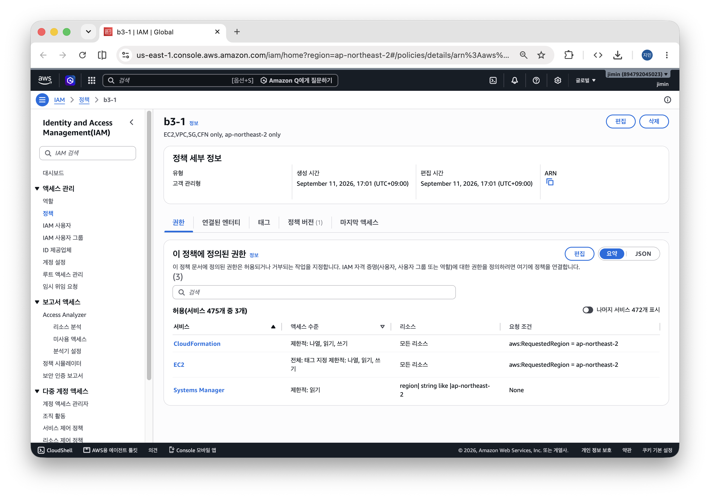 | 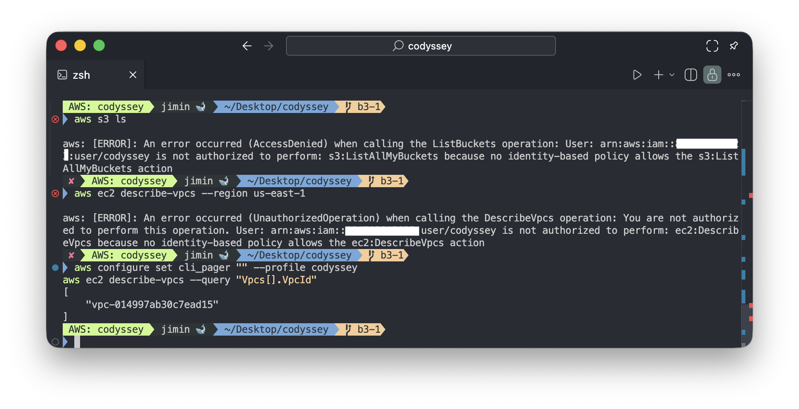 |

### 자격 증명 관리

- 콘솔과 CLI 모두 루트가 아닌 `codyssey`로만 작업했습니다.
- 액세스 키는 레포 밖 `~/.aws/credentials`에 보관했습니다.
- **EC2에는 액세스 키도 IAM 역할도 두지 않았습니다.** 서버에서 AWS API를 호출할 일이 없으므로 권한이 전혀 없는 상태가 가장 작은 권한입니다. 인스턴스는 IMDSv2(Required)가 적용돼 있습니다.

| CLI 프로필 설정 | 호출 주체 확인 |
|---|---|
| 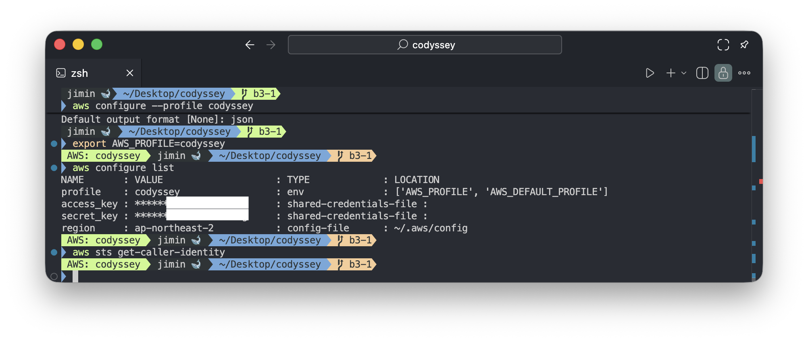 | 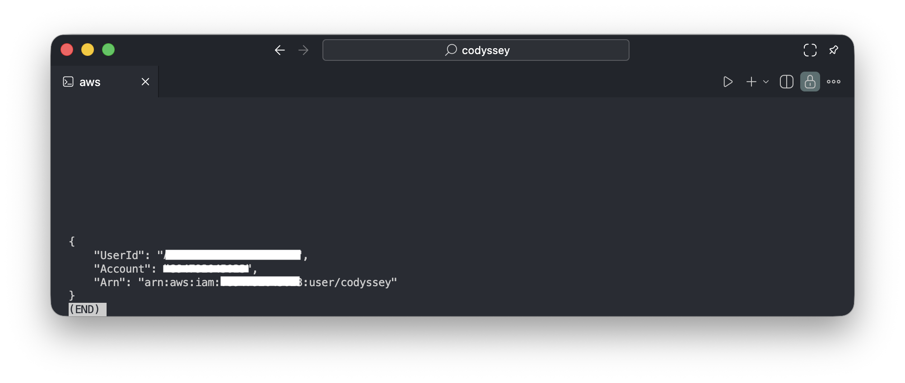 |

---

## 8. 트러블슈팅

[`docs/troubleshooting.md`](docs/troubleshooting.md)에 증상 → 가설 → 검증 → 조치 → 결과 → 재발 방지 순서로 기록했습니다.

---

## 9. 비용과 리소스 정리

### 과금 요인

| 요인 | 이 과제에서의 대응 |
|---|---|
| EC2 실행 시간 | 프리 티어 대상 `t3.micro`만 허용, 실습 후 종료 |
| EBS 볼륨 | 8GiB, `DeleteOnTermination`으로 인스턴스와 함께 삭제 |
| 퍼블릭 IPv4 주소 | 사용 시간 기준 과금 대상이라 인스턴스 종료로 반납 |
| Elastic IP | 사용하지 않음 (연결 안 된 EIP는 과금) |
| NAT Gateway, ALB, RDS | 생성하지 않음, IAM 정책에서도 권한 제외 |

### 정리 순서

리소스를 스택 단위로 만들었기 때문에 `delete-stack` 한 번으로 의존성 역순(인스턴스 → 보안 그룹·라우팅 → IGW 분리·삭제 → 서브넷 → VPC) 삭제가 자동으로 처리됩니다.

```bash
aws cloudformation delete-stack --stack-name codyssey-b3-1
aws cloudformation wait stack-delete-complete --stack-name codyssey-b3-1
aws ec2 delete-key-pair --key-name cloud-mission
```

스택 밖에서 만든 것(키페어, 액세스 키, DuckDNS 도메인)은 별도로 정리했습니다. 전체 항목과 확인 결과는 [`docs/cleanup-checklist.md`](docs/cleanup-checklist.md)에 있습니다.

**삭제 전**: 스택이 관리하는 리소스 9개와, 스택 목록에 나오지 않는 EBS 볼륨 ID를 먼저 기록했습니다.


**삭제 후**: 스택은 `DELETE_COMPLETE`, 인스턴스는 `terminated`, EBS·Elastic IP·IGW·VPC·NAT Gateway는 모두 빈 목록입니다. VPC와 IGW는 CloudFormation이 자동으로 붙이는 스택 이름 태그로 조회했습니다.


**키페어**: AWS에서 삭제하고 로컬 개인키 파일도 제거했습니다.


---

## 10. 개선 방향

- **배포 후 설정 자동화**: Docker 설치, 프록시·인증서 설정을 수동으로 적용했습니다. UserData 확장이나 Ansible 등으로 자동화하면 인스턴스를 새로 만들어도 같은 상태를 재현할 수 있습니다.
- **docker-compose**: 서비스가 늘어나 프록시·웹·인증서 갱신을 모두 컨테이너로 운영하게 되면 compose로 선언적으로 관리할 수 있습니다. 현재는 컨테이너가 하나라 `docker run`으로 충분합니다.
- **IAM 리소스 수준 제한**: 현재 정책은 작업 종류만 제한하고 `Resource`는 `*`입니다. `ec2:InstanceType` 조건이나 태그 조건으로 인스턴스 타입과 대상 리소스까지 좁힐 수 있습니다.
- **아웃바운드 제한**: 보안 그룹 아웃바운드를 80·443으로 좁히면 서버가 임의의 포트로 외부와 통신하는 것을 막을 수 있습니다.