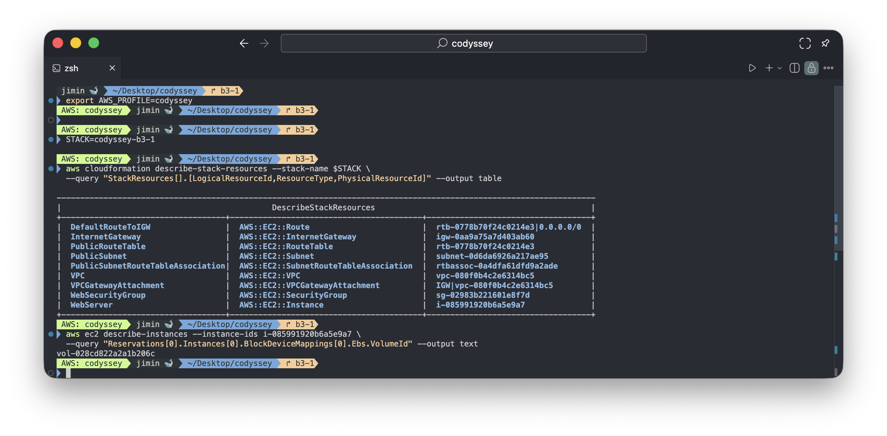
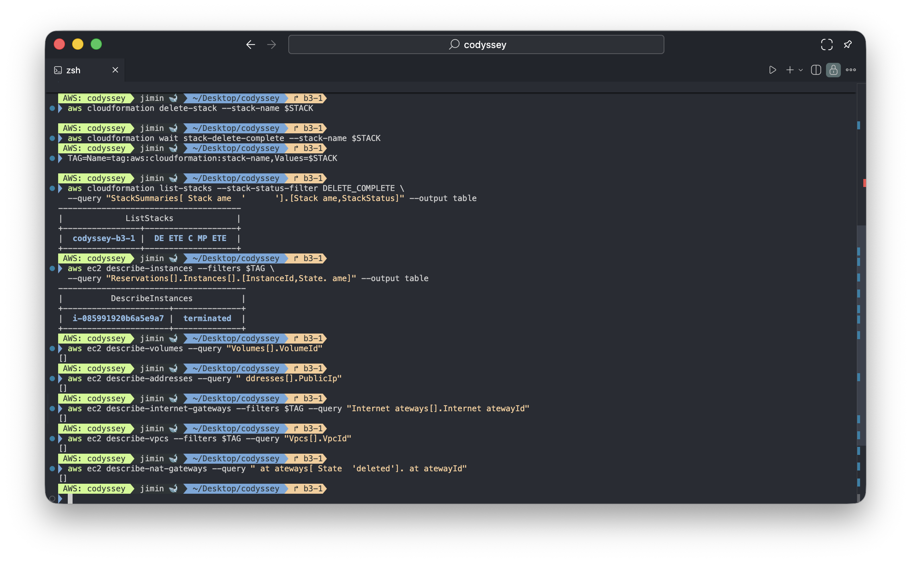
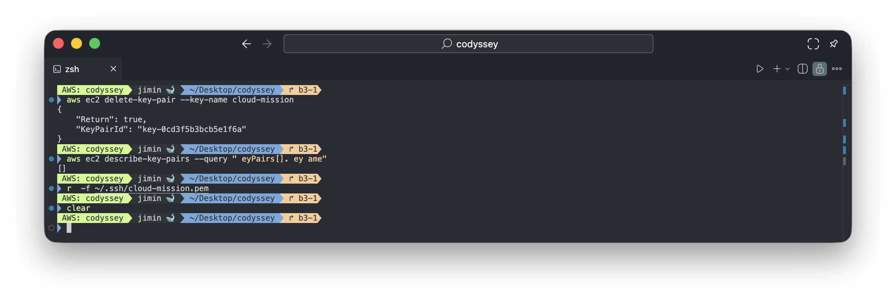

# 리소스 정리 리스트

| 항목 | 내용 |
|---|---|
| 정리 일자 | 2026-09-11 |
| 리전 | `ap-northeast-2` (서울) |
| 스택 | `codyssey-b3-1` |
| 작업 주체 | IAM 사용자 `codyssey` (액세스 키 삭제만 루트 계정) |

## 1. 삭제 대상 기록

삭제 전에 스택이 관리하는 리소스와, 스택 목록에 나오지 않는 리소스(EBS 볼륨, 키페어)의 ID를 기록했습니다.

| 리소스 | ID | 생성 주체 |
|---|---|---|
| EC2 인스턴스 | `i-085991920b6a5e9a7` | CloudFormation |
| EBS 볼륨 (루트) | `vol-028cd822a2a1b206c` | EC2 (인스턴스와 함께 생성) |
| 보안 그룹 | `sg-02983b221601e8f7d` | CloudFormation |
| 라우트 테이블 | `rtb-0778b70f24c0214e3` | CloudFormation |
| 라우트 (`0.0.0.0/0`) | `rtb-0778b70f24c0214e3\|0.0.0.0/0` | CloudFormation |
| 서브넷 연결 | `rtbassoc-0a4dfa61dfd9a2ade` | CloudFormation |
| 서브넷 | `subnet-0d6da6926a217ae95` | CloudFormation |
| 인터넷 게이트웨이 | `igw-0aa9a75a7d403ab60` | CloudFormation |
| VPC | `vpc-080f0b4c2e6314bc5` | CloudFormation |
| 키페어 | `cloud-mission` (`key-0cd3f5b3bcb5e1f6a`) | AWS CLI (스택 밖) |
| 도메인 | `cody-aws.duckdns.org` | DuckDNS (AWS 밖) |
| 액세스 키 | `codyssey` 사용자 액세스 키 | 루트 콘솔 (스택 밖) |



## 2. 정리 순서와 이유

리소스끼리 의존 관계가 있어서, 사용하는 쪽부터 지워야 사용되는 쪽을 지울 수 있습니다.

1. **EC2 인스턴스 종료**: 인스턴스가 서브넷 안의 네트워크 인터페이스, 보안 그룹, EBS를 붙잡고 있기 때문에 가장 먼저 종료합니다. `DeleteOnTermination: true`라 루트 EBS도 이때 함께 삭제됩니다.
2. **보안 그룹, 라우트, 서브넷 연결 삭제**: 인스턴스가 사라져야 보안 그룹을 지울 수 있습니다.
3. **IGW 분리(Detach) 후 삭제**: VPC에 붙어 있는 IGW는 바로 삭제할 수 없어 먼저 분리합니다.
4. **서브넷, 라우트 테이블 삭제**
5. **VPC 삭제**: 안에 남은 리소스가 하나라도 있으면 삭제되지 않으므로 마지막입니다.
6. **스택 밖 리소스**: 키페어, DuckDNS 도메인, 액세스 키를 정리합니다. 액세스 키는 위 확인 작업을 CLI로 해야 하므로 맨 마지막에 삭제합니다.

1~5단계는 `aws cloudformation delete-stack` 한 번으로 CloudFormation이 의존성 역순으로 처리했습니다.

```bash
aws cloudformation delete-stack --stack-name codyssey-b3-1
aws cloudformation wait stack-delete-complete --stack-name codyssey-b3-1
```

## 3. 체크리스트

### 필수 항목

| 항목 | 확인 방법 | 결과 |
|---|---|---|
| EC2 인스턴스 종료 | `describe-instances` (스택 태그 필터) | `i-085991920b6a5e9a7` → `terminated` |
| EBS 볼륨 삭제 (미사용 포함) | `describe-volumes` (리전 전체) | `[]` — 루트 볼륨 `vol-028c...` 포함 볼륨 없음 |
| Elastic IP Release | `describe-addresses` | `[]` — 할당한 적 없음 |
| Internet Gateway Detach 및 삭제 | `describe-internet-gateways` (스택 태그 필터) | `[]` |
| VPC, 서브넷, 라우트 테이블 삭제 | `describe-vpcs` (스택 태그 필터) | `[]` — VPC는 내부 리소스가 남아 있으면 삭제되지 않으므로 서브넷·라우트 테이블·보안 그룹도 함께 삭제됨 |
| CloudFormation 스택 삭제 | `list-stacks --stack-status-filter DELETE_COMPLETE` | `codyssey-b3-1` → `DELETE_COMPLETE` |


### 스택 밖 리소스

| 항목 | 확인 방법 | 결과 |
|---|---|---|
| 키페어 삭제 | `delete-key-pair` → `describe-key-pairs` | `"Return": true` → `[]` |
| 로컬 개인키 삭제 | `rm -f ~/.ssh/cloud-mission.pem` | 삭제 |
| DuckDNS 도메인 삭제 | duckdns.org 도메인 목록 | |
| `codyssey` 액세스 키 비활성화 및 삭제 | 루트 콘솔 IAM → 보안 자격 증명 | |
| 로컬 자격 증명 정리 | `[codyssey]`, `AWS_PROFILE` | 


## 4. 증빙

**삭제 후 확인**



**키페어 삭제**

