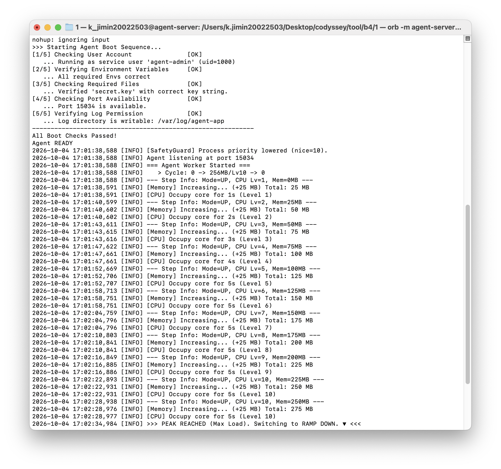
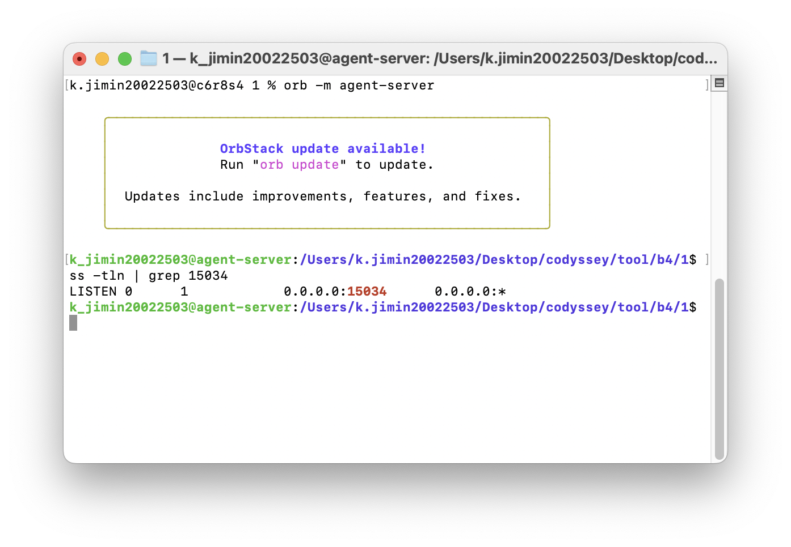
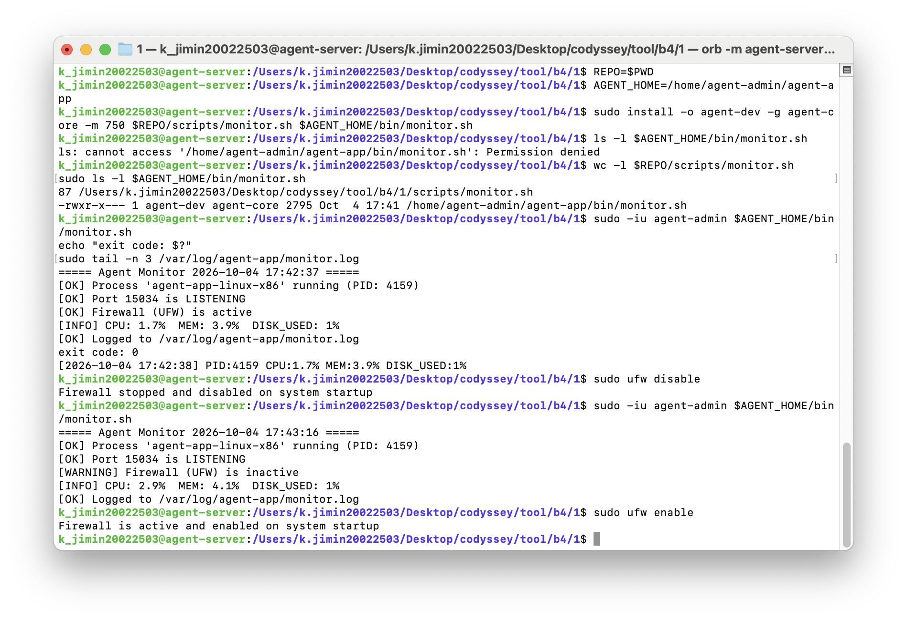
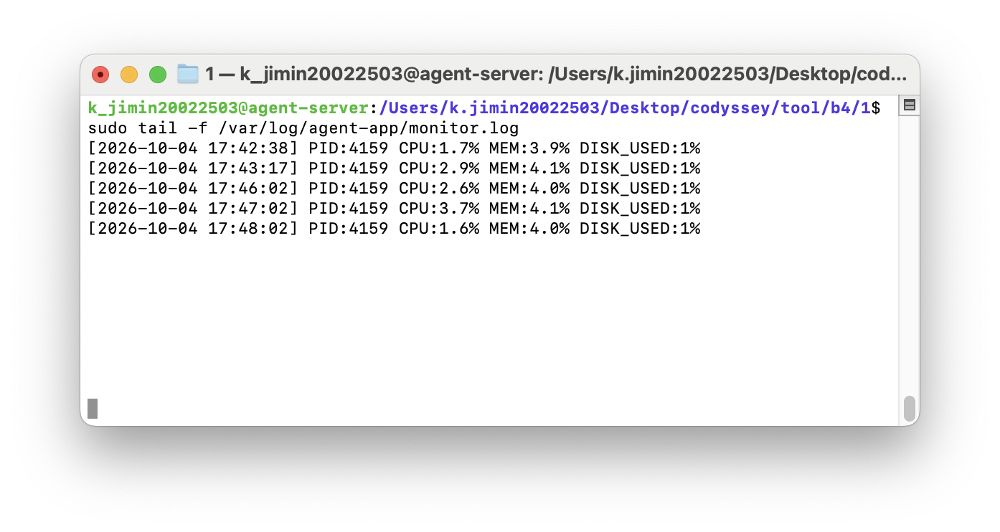

# 리눅스 서버 운영 환경 구축 및 관제 자동화

서버 보안 설정(SSH, 방화벽), 역할 기반 계정/권한 체계, 애플리케이션 실행 환경을 구성하고, 시스템 상태를 매분 기록하는 `monitor.sh`를 구현한 수행 내역서입니다.

## 목차

1. [실습 환경](#1-실습-환경)
2. [SSH 보안 설정](#2-ssh-보안-설정)
3. [방화벽 설정](#3-방화벽-설정)
4. [계정과 그룹](#4-계정과-그룹)
5. [디렉토리 구조와 권한](#5-디렉토리-구조와-권한)
6. [애플리케이션 실행 환경](#6-애플리케이션-실행-환경)
7. [monitor.sh](#7-monitorsh)
8. [cron 자동 실행](#8-cron-자동-실행)
9. [로그 용량 관리](#9-로그-용량-관리)
10. [운영 관점 정리](#10-운영-관점-정리)
11. [증거 자료 체크리스트](#11-증거-자료-체크리스트)

---

## 1. 실습 환경

| 항목 | 내용 |
|---|---|
| 호스트 | macOS (Intel) |
| 가상화 | OrbStack Linux Machine (`agent-server`) |
| OS | Ubuntu 22.04 LTS (x86_64) |
| 제공 앱 | `agent-app-linux-x86` (빌드된 실행 파일) |

Docker 컨테이너 대신 OrbStack의 Linux Machine을 선택했습니다. 컨테이너는 systemd가 없어 sshd·cron을 수동으로 띄워야 하고, UFW는 커널 방화벽 권한(`NET_ADMIN`)이 필요해 이번 과제처럼 "OS 자체를 운영"하는 실습과 맞지 않기 때문입니다. Linux Machine은 systemd가 동작해 실제 서버와 같은 방식으로 서비스를 관리할 수 있습니다.

### 레포 구조

```
tool/b4/1/
├── README.md                 ← 수행 내역서 (이 문서)
├── app/                      ← 제공 바이너리
├── scripts/
│   └── monitor.sh            ← 관제 스크립트 원본
└── docs/screenshots/         ← 증거 캡처
```

레포는 원본 보관용이고, 실제 서버 경로(`$AGENT_HOME/bin/monitor.sh`)에는 `install` 명령으로 소유자·권한을 지정해 배포했습니다. Mac에서 마운트된 폴더는 소유자/권한이 Mac 기준으로 보여 `agent-dev:agent-core 750` 같은 설정을 직접 걸 수 없기 때문입니다.

### 패키지 설치

```bash
sudo apt update
sudo apt install -y openssh-server ufw cron acl logrotate procps iproute2 vim
sudo timedatectl set-timezone Asia/Seoul
```

---

## 2. SSH 보안 설정

### 수행 명령

```bash
sudo sed -i 's/^#\?Port .*/Port 20022/' /etc/ssh/sshd_config
sudo sed -i 's/^#\?PermitRootLogin .*/PermitRootLogin no/' /etc/ssh/sshd_config
grep -r -E 'Port|PermitRootLogin' /etc/ssh/sshd_config.d/   # 덮어쓰는 설정 없는지 확인
sudo sshd -t                                                # 문법 검사
sudo systemctl enable ssh && sudo systemctl restart ssh
```

### 확인

```
$ grep -E '^(Port|PermitRootLogin)' /etc/ssh/sshd_config
Port 20022
PermitRootLogin no

$ sudo ss -tulnp | grep sshd
tcp   LISTEN 0  128     0.0.0.0:20022   0.0.0.0:*   users:(("sshd",pid=4045,fd=3))
tcp   LISTEN 0  128        [::]:20022      [::]:*   users:(("sshd",pid=4045,fd=4))
```

sshd가 IPv4·IPv6 모두에서 20022 포트로 LISTEN 중이며, root 원격 로그인은 차단되었습니다.

### 왜 기본 보안인가: SSH 위협 모델

| 위협 | 대응 | 효과와 한계 |
|---|---|---|
| 22번 포트를 노리는 자동화 스캔·무차별 대입 봇 | 포트를 20022로 변경 | 무작위 스캔 트래픽과 로그 소음이 크게 줄어듭니다. 다만 포트 스캔으로 찾을 수 있으므로 **보안 그 자체가 아니라 공격 표면을 줄이는 1차 필터**입니다. |
| `root` 계정 대상 비밀번호 추측 | `PermitRootLogin no` | `root`는 모든 리눅스에 존재하는 이름이라 공격자가 아이디를 추측할 필요가 없고, 뚫리면 즉시 전체 권한을 갖습니다. 차단하면 공격자는 아이디와 비밀번호를 모두 알아내야 하고, 일반 계정으로 들어와도 sudo 단계가 한 번 더 남습니다. |
| 비밀번호 무차별 대입 일반 | (추가 권장) 키 인증 + `PasswordAuthentication no`, fail2ban | 이번 과제 범위 밖이지만 실제 운영에서는 함께 적용하는 것이 일반적입니다. |

---

## 3. 방화벽 설정

UFW를 선택했습니다. Ubuntu 기본 도구라 추가 설치 없이 쓸 수 있고, 규칙 문법이 간단합니다.

### 수행 명령

```bash
sudo ufw default deny incoming
sudo ufw default allow outgoing
sudo ufw allow 20022/tcp
sudo ufw allow 15034/tcp
sudo ufw enable
```

들어오는 연결은 기본 전부 차단하고, 필요한 두 포트만 예외로 여는 **화이트리스트 방식**입니다. 원격 접속 중이라면 반드시 `allow 20022/tcp`를 먼저 하고 `enable` 해야 접속이 끊기지 않습니다.

### 확인

```
$ sudo ufw status verbose
Status: active
Logging: on (low)
Default: deny (incoming), allow (outgoing), deny (routed)
New profiles: skip

To                         Action      From
--                         ------      ----
20022/tcp                  ALLOW IN    Anywhere
15034/tcp                  ALLOW IN    Anywhere
20022/tcp (v6)             ALLOW IN    Anywhere (v6)
15034/tcp (v6)             ALLOW IN    Anywhere (v6)
```

허용 포트는 20022/tcp(SSH), 15034/tcp(APP) 두 개뿐이며 IPv4·IPv6 모두 동일하게 적용되었습니다.

---

## 4. 계정과 그룹

### 수행 명령

```bash
sudo groupadd agent-common
sudo groupadd agent-core

for u in agent-admin agent-dev agent-test; do
  sudo useradd -m -s /bin/bash $u
  sudo passwd $u
done

sudo usermod -aG agent-common,agent-core agent-admin
sudo usermod -aG agent-common,agent-core agent-dev
sudo usermod -aG agent-common            agent-test
```

### 역할 매핑

| 계정 | 역할 | agent-common | agent-core |
|---|---|:---:|:---:|
| agent-admin | 운영/관리, 앱 실행, cron 실행자 | ✅ | ✅ |
| agent-dev | 개발/운영, monitor.sh 작성자 | ✅ | ✅ |
| agent-test | QA/테스트 | ✅ | ❌ |

### 확인

```
$ id agent-admin; id agent-dev; id agent-test
<!-- TODO: 출력 붙여넣기 -->
```

---

## 5. 디렉토리 구조와 권한

### 구조

```
/home/agent-admin/agent-app/          $AGENT_HOME          agent-admin:agent-common  750
├── agent-app-linux-x86                                    agent-admin:agent-core    750
├── upload_files/                     공유 디렉토리        agent-admin:agent-common  2770 + ACL
├── api_keys/                         보안 디렉토리        agent-admin:agent-core    2770 + ACL
│   ├── t_secret.key
│   └── secret.key -> t_secret.key
└── bin/                                                   agent-dev:agent-core      2750
    └── monitor.sh                                         agent-dev:agent-core      750

/var/log/agent-app/                   보안 디렉토리        agent-admin:agent-core    2770 + ACL
└── monitor.log
```

### 수행 명령

```bash
AGENT_HOME=/home/agent-admin/agent-app
sudo mkdir -p $AGENT_HOME/{upload_files,api_keys,bin} /var/log/agent-app

# Ubuntu 22.04는 홈 디렉토리가 750이라, 다른 계정이 '통과'만 할 수 있게 x 권한 부여
sudo setfacl -m g:agent-common:x /home/agent-admin

# AGENT_HOME: agent-common까지 진입 가능
sudo chown agent-admin:agent-common $AGENT_HOME
sudo chmod 750 $AGENT_HOME

# 공유 디렉토리: agent-common RW
sudo chown agent-admin:agent-common $AGENT_HOME/upload_files
sudo chmod 2770 $AGENT_HOME/upload_files
sudo setfacl -m g:agent-common:rwx,d:g:agent-common:rwx $AGENT_HOME/upload_files

# 보안 디렉토리: agent-core만 RW
for d in $AGENT_HOME/api_keys /var/log/agent-app; do
  sudo chown agent-admin:agent-core $d
  sudo chmod 2770 $d
  sudo setfacl -m g:agent-core:rwx,d:g:agent-core:rwx $d
done

# bin: agent-dev 소유, agent-core가 실행
sudo chown agent-dev:agent-core $AGENT_HOME/bin
sudo chmod 2750 $AGENT_HOME/bin
```

권한 앞의 `2`는 **setgid**입니다. 디렉토리 안에 새로 만들어지는 파일이 만든 사람의 기본 그룹이 아니라 디렉토리의 그룹을 따라가게 합니다. `d:` 접두사는 **default ACL**로, 새 파일에도 같은 ACL이 상속됩니다. 두 가지를 함께 써야 agent-admin이 만든 로그 파일을 agent-dev도 읽을 수 있는 상태가 계속 유지됩니다.

### 확인

```
$ sudo ls -l /home/agent-admin/agent-app/
-rwxr-x---  1 agent-admin agent-core   6498144 Oct  4 16:52 agent-app-linux-x86
drwxrws---+ 1 agent-admin agent-core        24 Oct  4 16:51 api_keys
drwxr-s---  1 agent-dev   agent-core         0 Oct  4 16:50 bin
drwxrws---+ 1 agent-admin agent-common      16 Oct  4 16:51 upload_files
```

`s`는 setgid, `+`는 ACL이 설정되어 있다는 표시입니다.

```
$ sudo getfacl $AGENT_HOME/upload_files $AGENT_HOME/api_keys /var/log/agent-app
<!-- TODO: 출력 붙여넣기 -->
```

**실제 접근 테스트 (agent-test 계정)**

```
$ sudo -u agent-test touch $AGENT_HOME/upload_files/test.txt && echo "upload OK"
$ sudo -u agent-test ls $AGENT_HOME/api_keys
$ sudo -u agent-test ls /var/log/agent-app
<!-- TODO: 출력 붙여넣기 (upload OK / Permission denied / Permission denied 기대) -->
```

권한이 없는 일반 사용자 계정(실습 계정)으로 `bin/`에 접근했을 때도 거부되는 것을 확인했습니다.

```
$ ls -l $AGENT_HOME/bin/monitor.sh
ls: cannot access '/home/agent-admin/agent-app/bin/monitor.sh': Permission denied
```

### 왜 공유 디렉토리와 보안 디렉토리를 나누는가

`upload_files`는 QA를 포함한 모든 구성원이 테스트 파일을 주고받는 **협업 공간**이므로 agent-common 전체에 읽기/쓰기를 허용합니다.

`api_keys`에는 외부 서비스 인증 키가 들어 있어 유출되면 키 소유자 권한으로 외부 API가 호출될 수 있습니다. `/var/log/agent-app`에는 PID, 시스템 자원 상태, 장애 시점 같은 운영 정보가 쌓이는데, 이는 공격자에게 시스템 구조를 알려주는 정찰 자료가 되고 로그를 지우거나 조작하면 장애 원인 추적이 불가능해집니다. 그래서 두 디렉토리는 운영·개발 책임이 있는 agent-core에만 열어두었습니다.

QA 업무에는 키와 운영 로그가 필요하지 않으므로, agent-test는 처음부터 접근할 수 없게 하는 것이 **최소 권한 원칙**입니다. 권한을 넓게 줬다가 줄이는 것보다, 필요한 만큼만 주고 필요할 때 추가하는 쪽이 사고 범위를 작게 유지합니다.

---

## 6. 애플리케이션 실행 환경

### 환경 변수

모든 계정이 로그인할 때 읽는 `/etc/profile.d/`에 등록했습니다.

```bash
sudo tee /etc/profile.d/agent-app.sh > /dev/null <<'EOF'
export AGENT_HOME=/home/agent-admin/agent-app
export AGENT_PORT=15034
export AGENT_UPLOAD_DIR=$AGENT_HOME/upload_files
export AGENT_KEY_PATH=$AGENT_HOME/api_keys
export AGENT_LOG_DIR=/var/log/agent-app
EOF
```

```
$ sudo -iu agent-admin env | grep AGENT
AGENT_UPLOAD_DIR=/home/agent-admin/agent-app/upload_files
AGENT_PORT=15034
AGENT_KEY_PATH=/home/agent-admin/agent-app/api_keys
AGENT_HOME=/home/agent-admin/agent-app
AGENT_LOG_DIR=/var/log/agent-app
```

**환경 변수로 실행 환경을 고정하는 이유**: 경로와 포트를 코드에 박아두면 서버나 배포 환경이 바뀔 때마다 코드를 수정해야 합니다. 환경 변수로 분리하면 같은 실행 파일을 개발·테스트·운영 서버에서 설정만 바꿔 그대로 쓸 수 있고, 여러 스크립트(앱, monitor.sh)가 같은 값을 공유해 경로 불일치로 인한 오류를 막을 수 있습니다. 검증은 위처럼 **실행 계정으로 로그인한 상태에서** `env`로 확인하는 것이 정확합니다. 내 계정에서 보이는 값과 실행 계정에서 보이는 값은 다를 수 있기 때문입니다.

### 키 파일

```bash
sudo -u agent-admin bash -c "echo agent_api_key_test > $AGENT_HOME/api_keys/t_secret.key"
sudo chmod 640 $AGENT_HOME/api_keys/t_secret.key
sudo -u agent-admin ln -s t_secret.key $AGENT_HOME/api_keys/secret.key
```

### 과제 문서와 실제 앱의 차이 대응

첫 실행에서 Boot Sequence가 두 번 실패했고, 앱의 오류 메시지를 근거로 설정을 맞췄습니다.

| 단계 | 과제 문서 | 앱 오류 메시지 | 대응 |
|---|---|---|---|
| [2/5] 환경 변수 | `AGENT_KEY_PATH=$AGENT_HOME/api_keys/t_secret.key` | `Key Path Mismatch. Expected: /home/agent-admin/agent-app/api_keys` | 파일 경로가 아닌 **디렉토리 경로**로 수정 |
| [3/5] 필수 파일 | `t_secret.key` | `Missing File: secret.key` | `t_secret.key`를 유지하고 `secret.key` **심볼릭 링크** 생성 |

키 파일을 복사하지 않고 심볼릭 링크를 쓴 이유는, 실제 키를 한 곳에만 두어야 나중에 키를 교체할 때 한쪽만 바뀌는 불일치가 생기지 않기 때문입니다.

### 앱 실행

root가 아닌 agent-admin 계정으로 실행했습니다. 앱이 api_keys를 읽고 로그 디렉토리에 써야 하므로 agent-core 소속 계정이어야 합니다.

```bash
sudo cp $REPO/app/agent-app-linux-x86 $AGENT_HOME/
sudo chown agent-admin:agent-core $AGENT_HOME/agent-app-linux-x86
sudo chmod 750 $AGENT_HOME/agent-app-linux-x86

sudo -iu agent-admin
cd $AGENT_HOME
nohup ./agent-app-linux-x86 > $AGENT_HOME/app.out 2>&1 &
```

cron 모니터링 동안 앱이 계속 떠 있어야 하므로 `nohup`으로 백그라운드 실행했습니다.

**Boot Sequence 5단계 [OK] + Agent READY**



**0.0.0.0:15034 LISTEN**



---

## 7. monitor.sh

소스: [`scripts/monitor.sh`](scripts/monitor.sh)

### 배포

```bash
sudo install -o agent-dev -g agent-core -m 750 $REPO/scripts/monitor.sh $AGENT_HOME/bin/monitor.sh
```

```
$ sudo ls -l $AGENT_HOME/bin/monitor.sh
-rwxr-x--- 1 agent-dev agent-core 2795 Oct  4 17:41 /home/agent-admin/agent-app/bin/monitor.sh
```

소유자 agent-dev(작성자), 그룹 agent-core, 권한 750입니다. agent-admin은 agent-core 그룹의 `r-x`로 실행할 수 있고, 수정은 agent-dev만 가능합니다. 실행하는 사람과 고칠 수 있는 사람을 분리해 운영 중 스크립트가 임의로 바뀌는 것을 막습니다.

### 동작 흐름

```
[1] 프로세스 확인  ── 없음 → [ERROR] exit 1
[2] 포트 확인      ── LISTEN 아님 → [ERROR] exit 1
[3] 방화벽 확인    ── 비활성 → [WARNING] (계속 진행)
[4] CPU/MEM/DISK 수집
[5] 임계값 비교    ── 초과 → [WARNING] (계속 진행)
[6] 로그 용량 확인 ── 10MB 이상 → 회전
[7] monitor.log에 한 줄 기록
```

### 도구 선택 이유

| 목적 | 사용 | 대신 쓰지 않은 것 | 이유 |
|---|---|---|---|
| 프로세스 확인 | `pgrep -f` | `ps aux \| grep` | `ps \| grep`은 grep 자기 자신이 결과에 섞여 `grep -v grep`을 덧붙여야 합니다. `pgrep`은 PID만 깔끔하게 반환해 변수에 바로 담을 수 있습니다. `-f`는 전체 명령줄로 찾는 옵션으로, 리눅스가 프로세스 이름을 15자로 자르기 때문에(`agent-app-linux`) 정확한 파일명으로 찾으려면 필요합니다. |
| 포트 확인 | `ss -tln "sport = :15034"` | `netstat` | `netstat`은 net-tools 패키지 소속으로 deprecated 되어 Ubuntu에 기본 설치되지 않습니다. `ss`는 iproute2 기본 도구이고 커널에서 직접 소켓 정보를 읽어 더 빠르며, 필터 문법으로 특정 포트만 조회할 수 있습니다. `-p`(프로세스 정보)는 root 권한이 필요해 일반 계정 실행을 위해 쓰지 않았습니다. |
| 방화벽 확인 | `/etc/ufw/ufw.conf`의 `ENABLED=yes` | `ufw status` | `ufw status`는 root 전용이라 agent-admin(일반 계정)으로 실행하면 실패합니다. 설정 파일은 누구나 읽을 수 있어 sudo 없이 활성 상태를 판단할 수 있습니다. |
| CPU | `/proc/stat` 1초 간격 2회 측정 | `top -bn1` | `top -bn1`의 첫 출력은 부팅 이후 누적 평균이라 현재 부하를 반영하지 못합니다. |
| MEM | `free` | | 사용량(used)/전체(total) 비율 |
| DISK | `df -P /` | `df /` | `-P`(POSIX 형식)는 장치 이름이 길어도 한 줄로 출력되어 awk 파싱이 안정적입니다. |

### 자원 수치 파싱 방법

**CPU**: `/proc/stat`의 첫 줄은 부팅 이후 CPU가 각 상태(user, nice, system, idle, iowait, irq, softirq, steal)에 쓴 누적 시간입니다. 1초 간격으로 두 번 읽어 차이를 구하면 그 1초 동안의 전체 시간과 유휴 시간이 나오고, `(전체 - 유휴) / 전체 × 100`이 CPU 사용률입니다. iowait도 CPU가 일하지 않은 시간이므로 유휴에 포함했습니다.

**MEM**: `free` 출력의 `Mem:` 줄에서 used(3번째) / total(2번째) × 100.

**DISK**: `df -P /`의 두 번째 줄에서 Use% 열(5번째)의 `%` 기호를 제거한 정수값.

CPU·MEM은 소수점 첫째 자리까지, DISK는 `df`가 정수로 주므로 정수로 기록합니다. bash는 정수 연산만 가능해서, 소수 계산과 임계값 비교는 `awk`로 처리했습니다.

### 실행 결과

**정상 실행 / 방화벽 비활성 시 경고**



```
===== Agent Monitor 2026-10-04 17:42:37 =====
[OK] Process 'agent-app-linux-x86' running (PID: 4159)
[OK] Port 15034 is LISTENING
[OK] Firewall (UFW) is active
[INFO] CPU: 1.7%  MEM: 3.9%  DISK_USED: 1%
[OK] Logged to /var/log/agent-app/monitor.log
exit code: 0
```

방화벽을 일시적으로 끄고 실행하면 `[WARNING] Firewall (UFW) is inactive`가 출력되지만, 스크립트는 종료되지 않고 자원 수집과 로그 기록까지 완료합니다. 테스트 후 즉시 `sudo ufw enable`로 복구했습니다.

**앱 중지 시 exit 1**

```
<!-- TODO: 출력 붙여넣기 -->
```

### 경고와 종료를 나눈 이유

프로세스나 포트가 죽었다는 것은 **서비스가 멈췄다**는 뜻입니다. 이때는 자원 수치를 기록해도 의미가 없고, exit code 1로 끝내야 cron 결과나 상위 알림 시스템, 재시작 스크립트가 "장애"를 기계적으로 감지할 수 있습니다.

반면 방화벽 비활성이나 CPU/MEM 임계값 초과는 **서비스는 돌아가지만 주의가 필요한 상태**입니다. 이때 스크립트가 멈추면 정작 그 순간의 자원 기록이 빠져, 나중에 "언제부터 부하가 높았는지"를 추적할 데이터가 사라집니다. 그래서 경고만 출력하고 기록은 계속 남깁니다.

---

## 8. cron 자동 실행

### 등록

```bash
sudo systemctl enable --now cron
sudo -iu agent-admin
crontab -e
```

```
$ crontab -l
* * * * * /home/agent-admin/agent-app/bin/monitor.sh >> /var/log/agent-app/cron.out 2>&1
```

monitor.log는 스크립트가 직접 기록하고, `cron.out`에는 화면 출력(`[OK]`, `[WARNING]` 등)과 에러를 따로 남겨 cron 실행 자체의 문제를 추적할 수 있게 했습니다.

cron은 `/etc/profile.d`를 읽지 않아 환경 변수가 비어 있는 상태로 실행됩니다. 그래서 monitor.sh 안에 `AGENT_HOME="${AGENT_HOME:-/home/agent-admin/agent-app}"` 형태로 기본값을 두고, `PATH`도 명시했습니다. 수동 실행은 되는데 cron에서만 실패하는 가장 흔한 원인이 이 부분입니다.

### 자동 실행 확인

```
$ sudo journalctl -u cron -n 10 --no-pager
Oct 04 17:46:01 agent-server CRON[5079]: pam_unix(cron:session): session opened for user agent-admin(uid=1000) by (uid=0)
Oct 04 17:46:01 agent-server CRON[5080]: (agent-admin) CMD (/home/agent-admin/agent-app/bin/monitor.sh >> /var/log/agent-app/cron.out 2>&1)
Oct 04 17:46:02 agent-server CRON[5079]: pam_unix(cron:session): session closed for user agent-admin
```



```
[2026-10-04 17:42:38] PID:4159 CPU:1.7% MEM:3.9% DISK_USED:1%    ← 수동 실행
[2026-10-04 17:43:17] PID:4159 CPU:2.9% MEM:4.1% DISK_USED:1%    ← 수동 실행 (방화벽 경고 테스트)
[2026-10-04 17:46:02] PID:4159 CPU:2.6% MEM:4.0% DISK_USED:1%    ← cron
[2026-10-04 17:47:02] PID:4159 CPU:3.7% MEM:4.1% DISK_USED:1%    ← cron
[2026-10-04 17:48:02] PID:4159 CPU:1.6% MEM:4.0% DISK_USED:1%    ← cron
```

17:46부터 1분 간격으로 agent-admin 계정의 cron이 자동 기록하고 있습니다.

### `>` 와 `>>` 의 차이

`>`는 파일을 **비우고 새로 씁니다(덮어쓰기)**. `>>`는 기존 내용 뒤에 **이어 씁니다(추가)**. 로그는 시간 순으로 쌓여야 추적할 수 있으므로 반드시 `>>`를 써야 하며, 실수로 `>`를 쓰면 매분 직전 기록이 지워져 항상 한 줄만 남습니다. `2>&1`은 에러 출력(2)도 일반 출력(1)과 같은 곳으로 보내라는 뜻으로, cron 실행 중 에러가 나도 `cron.out`에 남게 합니다.

---

## 9. 로그 용량 관리

### 방식: 스크립트 내장 회전

monitor.sh의 `rotate_log` 함수가 기록 직전에 monitor.log 크기를 확인합니다.

```
monitor.log ≥ 10MB 이면
  monitor.log.9 삭제
  monitor.log.8 → .9, ... , .1 → .2
  monitor.log   → .1
  새 monitor.log 에 기록 시작
```

결과적으로 `monitor.log` + `.1` ~ `.9`, **최대 10개 파일 × 10MB**를 유지합니다.

### logrotate 대신 스크립트를 선택한 이유

logrotate는 기본적으로 **하루 한 번**(systemd timer / cron.daily) 실행되어 그때 크기를 검사합니다. 이 과제는 1분마다 로그를 쓰므로, 크기 기준을 정확히 지키려면 logrotate 자체를 더 자주 돌리도록 별도 설정해야 합니다. 스크립트에 내장하면 **기록할 때마다** 크기를 검사하므로 10MB 기준이 정확히 지켜지고, 외부 설정 파일 없이 스크립트 하나로 동작이 완결되어 다른 서버로 옮길 때도 누락될 위험이 없습니다.

logrotate로 같은 정책을 구현한다면 다음과 같습니다(참고용, 미적용).

```
# /etc/logrotate.d/agent-app
/var/log/agent-app/monitor.log {
    size 10M
    rotate 9
    missingok
    notifempty
    create 0660 agent-admin agent-core
}
```

이 경우 일일 실행만으로는 하루 동안 10MB를 넘길 수 있으므로, logrotate를 매시간 실행하도록 timer를 조정해야 합니다.

---

## 10. 운영 관점 정리

### 포트가 열리지 않을 때: 바인딩 문제 vs 방화벽 문제

외부에서 15034에 접속이 안 될 때, 원인은 **앱이 포트를 못 열었는지**와 **열었는데 방화벽이 막는지**로 나뉩니다. 서버 안에서 먼저 확인하면 둘을 구분할 수 있습니다.

| 단계 | 명령 | 결과 해석 |
|---|---|---|
| 1. 서버 내부 LISTEN 확인 | `ss -tln "sport = :15034"` | LISTEN 없음 → **바인딩 문제**, 2로 / LISTEN 있음 → 3으로 |
| 2. 바인딩 실패 원인 | `sudo ss -tlnp "sport = :15034"`, `cat $AGENT_HOME/app.out` | 다른 프로세스가 이미 점유(`Address already in use`)했는지, 앱 Boot Sequence [4/5]가 FAIL인지 확인 |
| 3. 바인딩 주소 확인 | `ss -tln` 의 Local Address | `127.0.0.1:15034`면 외부에서 접근 불가. `0.0.0.0:15034`여야 함 |
| 4. 방화벽 확인 | `sudo ufw status` | 15034/tcp ALLOW가 없으면 **방화벽 문제** |
| 5. 외부 접속 테스트 | (Mac에서) `nc -vz agent-server.orb.local 15034` | 3·4가 정상인데 실패하면 네트워크 경로 문제 |

monitor.sh는 1단계(서버 내부 LISTEN)를 `[ERROR]`로, 4단계(방화벽 활성 여부)를 `[WARNING]`으로 따로 출력하므로, 로그만 보고도 어느 쪽 문제인지 1차 구분이 가능합니다.

### 로그가 급증했을 때

| 시점 | 대응 |
|---|---|
| 단기 (지금 디스크가 찰 것 같을 때) | `du -sh /var/log/agent-app/*`로 큰 파일 확인 → 오래된 회전 파일 압축(`gzip`) 또는 삭제. 쓰고 있는 파일은 `rm` 대신 `: > monitor.log`로 비워야 프로세스의 파일 핸들이 꼬이지 않습니다. 동시에 급증 원인(오류 반복 출력 등)을 로그 내용으로 파악합니다. |
| 중기 (재발 방지) | 크기 기반 회전(현재 10MB × 10개)으로 상한선 유지. 오래된 로그 압축·아카이브·삭제 정책 적용(보너스 2). 필요하면 기록 주기나 상세도 조정. |
| 장기 (구조 개선) | monitor.sh가 이미 `DISK_USED > 80%` 경고를 내므로 이를 알림(메일·메신저)과 연결해 사람이 먼저 알게 합니다. 서버가 늘어나면 로그를 중앙 수집 시스템으로 보내고, 서버 로컬에는 짧은 기간만 보관합니다. |

### 웹서버로 전환한다면

현재 monitor.sh를 Nginx 같은 웹서버 관제로 바꿀 때 점검할 항목입니다.

| 항목 | 현재 | 웹서버 전환 시 |
|---|---|---|
| 프로세스 | `APP_NAME` 단일 프로세스 | `nginx` master + worker 여러 개. master 존재 확인과 함께 worker 개수가 기대값인지 확인 |
| 포트 | 15034 | 80, 443. 방화벽 규칙도 함께 변경 (`ufw allow 80,443/tcp`) |
| Health Check | 포트 LISTEN 여부 | LISTEN만으로는 부족. `curl -s -o /dev/null -w "%{http_code}" http://localhost/`로 실제 200 응답 확인 |
| 로그 | monitor.log | access.log / error.log 추가 관찰. 5xx 비율, error.log 증가량을 지표로 |
| 임계값 | CPU 20%, MEM 10% (실습용) | 트래픽 패턴에 맞게 재설정. 웹서버는 순간 부하가 정상인 경우가 많아, 단일 측정보다 연속 N회 초과 시 경고하는 방식이 오탐을 줄임 |

---

## 11. 증거 자료 체크리스트

| 항목 | 위치 |
|---|---|
| SSH 포트 변경(20022) 및 Root 원격 접속 차단 | [2. SSH 보안 설정](#2-ssh-보안-설정) |
| 방화벽 활성화 및 20022/tcp, 15034/tcp만 허용 | [3. 방화벽 설정](#3-방화벽-설정) |
| 계정/그룹 생성 | [4. 계정과 그룹](#4-계정과-그룹) |
| 디렉토리 구조 및 권한(ACL 포함) | [5. 디렉토리 구조와 권한](#5-디렉토리-구조와-권한) |
| 앱 Boot Sequence 5단계 [OK] 및 Agent READY | [6. 애플리케이션 실행 환경](#6-애플리케이션-실행-환경) |
| monitor.sh 실행 결과(프로세스/포트/리소스/경고) | [7. monitor.sh](#7-monitorsh) |
| monitor.log 누적 기록 | [8. cron 자동 실행](#8-cron-자동-실행) |
| crontab 매분 실행 등록 및 자동 실행 | [8. cron 자동 실행](#8-cron-자동-실행) |